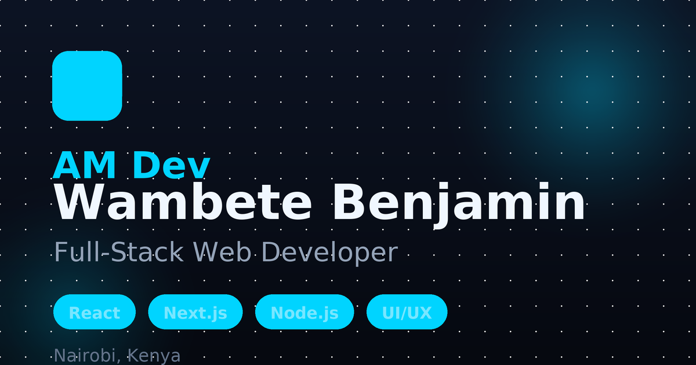

# AM Dev — Wambete Benjamin Portfolio

A stunning, fully-responsive personal portfolio for **Wambete Benjamin**, a full-stack web developer based in Nairobi, Kenya. Built with **Next.js 14 (App Router)** + **Tailwind CSS** + **Framer Motion**, and deploy-ready on **Vercel**.



## ✨ Features

| Area | Details |
| --- | --- |
| 🎨 Design | Dark theme with electric-blue (`#00D4FF`) & white accents, glassmorphism cards, Poppins (headings) + Inter (body) |
| 🦸 Hero | Full-screen, particle-network canvas background, typewriter cycling *Full Stack Developer / UI/UX Designer / Problem Solver*, orbiting avatar frame |
| 📊 About | Glowing conic-gradient image frame, animated count-ups (5+ years, 50+ projects, 30+ clients) |
| 🛠 Skills | Scroll-triggered animated skill bars + tools marquee |
| 🚀 Projects | 6 glass cards with screenshots, tech badges, hover descriptions, Live Demo / GitHub buttons |
| 💬 Testimonials | Auto-sliding carousel (pauses on hover), star ratings, avatars, dots + arrows |
| 📝 Blog | 3 post cards with category tags & read time, plus full article pages at `/blog/[slug]` |
| 📧 Contact | Working form (Name / Email / Subject / Message) → `/api/contact` (Nodemailer, Gmail SMTP) with success/error toasts |
| 💚 WhatsApp | Floating pulsing widget that expands on hover, click-tracking via `/api/track-whatsapp`, plus "Hire Me" CTA |
| 📱 Mobile | Hamburger slide-in drawer, ≥48px touch targets, mobile-first breakpoints |
| 🔍 SEO | Meta + Open Graph + Twitter Card, JSON-LD Person schema, `sitemap.xml`, `robots.txt`, PWA manifest |

## 🧱 Tech Stack

- **Next.js 14** (App Router, TypeScript)
- **Tailwind CSS** + custom CSS (glass, glow, shimmer)
- **Framer Motion** (scroll reveals, carousels, drawer)
- **Custom canvas particles** (particles.js-style, zero-dependency)
- **Nodemailer** (Gmail SMTP) for the contact form

## 🚀 Getting Started

```bash
npm install
cp .env.example .env.local   # fill in your values
npm run dev                  # http://localhost:3000
```

### Environment variables (`.env.local`)

| Variable | Purpose |
| --- | --- |
| `SMTP_USER` | Gmail address used to **send** contact-form emails |
| `SMTP_PASS` | Gmail **App Password** (Google Account → Security → 2FA → App passwords) |
| `SMTP_HOST` / `SMTP_PORT` / `SMTP_SECURE` | Optional overrides — default `smtp.gmail.com:465` TLS; use `587` + `false` for STARTTLS |
| `CONTACT_TO` | Optional: delivery inbox (defaults to `SMTP_USER`) |
| `NEXT_PUBLIC_WHATSAPP` | WhatsApp number in international format without `+` (default `254112272061`) |
| `NEXT_PUBLIC_SITE_URL` | Public URL, used for SEO/OG/sitemap (e.g. `https://your-domain.com`) |

> Without SMTP credentials the contact API still works in **log mode** — it prints submissions to the server console and returns success, so you can test the form before wiring Gmail. The same fallback engages if the host can't reach the SMTP server (e.g. restricted networks); auth failures surface as errors so misconfiguration is never silent.

## 🔌 API Routes

| Route | Method | Description |
| --- | --- | --- |
| `/api/contact` | `POST` | Validates + sends the contact form via Gmail SMTP. Includes honeypot spam trap and CORS headers. |
| `/api/track-whatsapp` | `POST` | Logs WhatsApp button clicks (timestamp, referrer, path) to a JSON store (`/tmp` on Vercel + in-memory fallback). |
| `/api/track-whatsapp` | `GET` | Returns click analytics: `{ totalClicks, recentClicks }`. |

## ▲ Deploying to Vercel

1. Push this repo to GitHub.
2. On [vercel.com](https://vercel.com) → **Add New Project** → import the repo.
3. Add the environment variables above (Production + Preview).
4. Deploy — `vercel.json` is already included. No extra config needed.

## 🗂 Project Structure

```
app/
├── layout.tsx            # fonts, SEO metadata, JSON-LD
├── page.tsx              # one-page portfolio
├── globals.css           # Tailwind + glass/glow utilities
├── sitemap.ts / robots.ts / manifest.ts
├── icon.svg              # favicon
├── not-found.tsx         # custom 404
├── blog/                 # blog index + [slug] article pages
└── api/
    ├── contact/route.ts          # Nodemailer (Gmail SMTP)
    └── track-whatsapp/route.ts   # click analytics (JSON store)
components/               # Navbar, Hero, Particles, Typewriter, About,
                          # Skills, Projects, Testimonials, Blog, Contact,
                          # Footer, WhatsAppWidget, Toast, ScrollToTop…
lib/
├── site.ts               # ← ALL content: edit copy, links, projects, posts here
└── analytics-store.ts    # Vercel-compatible JSON click store
public/
├── images/               # avatar, project shots, testimonials, blog covers
└── cv/Wambete-Benjamin-CV.pdf
```

## 🖼 Swapping in your own photos

The avatar/about images are AI-generated placeholders (Facebook blocks automated photo access). Replace:

- `public/images/hero-avatar.jpg` — hero portrait (square)
- `public/images/about-portrait.jpg` — about section (4:5 portrait)
- `public/images/testimonial-*.jpg` — client headshots (square)
- `public/images/project-*.jpg` — project screenshots (16:10)

Keep the same filenames and no code changes are needed.

## 📄 License

© 2026 Wambete Benjamin. All Rights Reserved.
